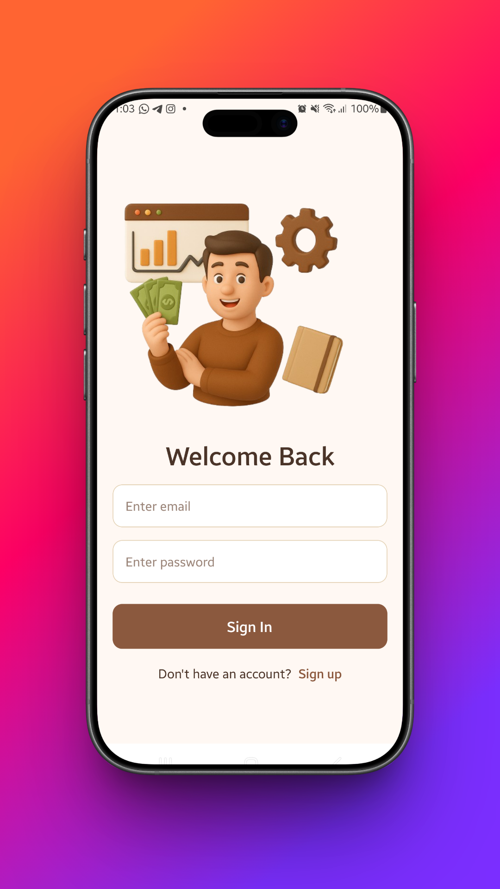
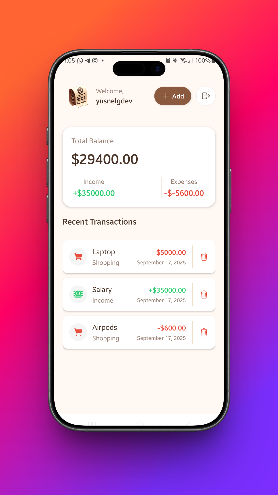
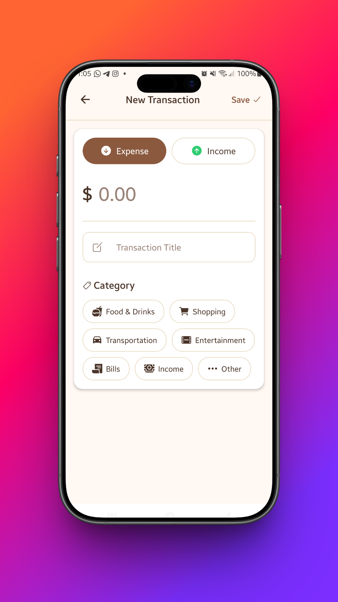

# 💸 Wallet App (React Native + Expo)

A simple **personal finance app** built with **React Native** and **Expo**.  
The goal is to track income and expenses while keeping the interface clean and easy to use.  

---

## 🚀 Features
- 📊 Real-time balance overview  
- ➕ Add income & ➖ Add expenses  
- 📜 Transaction history list  
- 🎨 Minimal and modern UI  
- 📱 Works on both Android & iOS with Expo  

---

## 🛠️ Tech Stack
- [React Native](https://reactnative.dev/)  
- [Expo](https://expo.dev/)  
- [React Navigation](https://reactnavigation.org/)  

---

## 📦 Installation
1. Clone the repository:
   ```bash
   git clone https://github.com/yourusername/wallet-app.git
   ```
2. Navigate into the project:
   ```bash
   cd wallet-app
   ```
3. Install dependencies:
   ```bash
   npm install
   ```
   or
   ```bash
   yarn install
   ```
4. Run the app with Expo:
   ```bash
   npx expo start
   ```

---

## 📷 Screenshots

<p align="center">
  
  
  <br/>
  
  
</p>

---

## 🙌 Credits
This project was created as a learning exercise after following a tutorial by [Burak Orkmez](https://github.com/burakorkmez).  